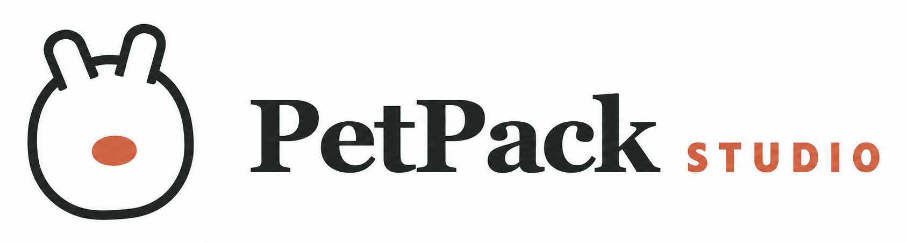
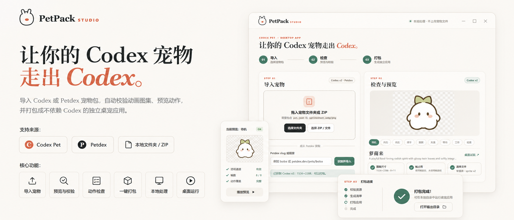

<p align="center"></p>

<p align="center"><a href="README.md">简体中文</a> · <strong>English</strong></p>

<p align="center"><strong>Let your Codex pet leave Codex.</strong></p>

<p align="center">Import a Codex or Petdex pet, validate and preview its animations,<br>then package it as a standalone Windows, macOS, or Linux desktop pet.</p>

<p align="center">
  <a href="https://modelscope.cn/studios/HongMingfeng/petpack">Online Studio</a> ·
  <a href="https://mingfenghong.github.io/petpack/">Documentation</a> ·
  <a href="https://github.com/MingfengHong/petpack/releases">Downloads</a> ·
  <a href="https://mingfenghong.github.io/petpack/getting-started">Quick start</a> ·
  <a href="https://mingfenghong.github.io/petpack/CROSS_PLATFORM">Cross-platform delivery</a>
</p>

<p align="center">
  <a href="https://github.com/MingfengHong/petpack/releases"></a>
  <a href="https://github.com/MingfengHong/petpack/actions/workflows/build.yml"></a>
  <a href="LICENSE"></a>
  <a href="https://v2.tauri.app/"></a>
</p>

<p align="center"></p>

## What's new in v0.3.1

- The release step clearly separates current-platform builds from cross-platform handoff kits.
- Fixed high-DPI clipping, corner pinning, dragging, and resizing in generated desktop pets.
- Desktop pets support 70%–140% scaling, bottom-handle dragging, hover controls, and tray size presets.
- The Studio stays in the taskbar when minimized and exits when closed.
- Desktop and Online Studio now switch between Chinese and English.
- Online Studio now includes import, validation, animation preview, and export.
- Handoff kits include one-click launchers for Windows, macOS, and Linux plus a bilingual offline guide.

## Why PetPack

Codex custom pets depend on the Codex runtime and cannot be distributed as ordinary desktop applications. PetPack combines a pet manifest, animated spritesheet, and lightweight runtime into a standalone desktop pet that does not require Codex on the recipient's computer.

PetPack does not pretend native cross-compilation is universal. It builds the current platform locally and uses a target-device handoff kit or native GitHub Actions runner for other operating systems.

## Features

| Feature | Description |
| --- | --- |
| Multiple import sources | Codex v2, Codex/Petdex v1, local folders, ZIP, `pet.json`, spritesheets, and Petdex links. |
| Strict validation | Manifest, dimensions, occupied frames, transparent cells, safe paths, and v2 declaration checks. |
| Animation preview | Preview all 9 standard actions; v2 pets also support 16 look directions. |
| Standalone desktop pet | Transparent, frameless, always-on-top, draggable, scalable, tray-hosted, and absent from the taskbar. |
| Current-platform build | Produces a portable folder, native executable, and ZIP without Codex. |
| Cross-platform handoff | Exports pet data, a lightweight builder, one-click launchers, and an offline guide. |
| Online Studio | Docker-hosted import, validation, animated preview, and handoff-kit download. |

## Download

Open [Releases](https://github.com/MingfengHong/petpack/releases) and choose the matching artifact:

| Platform | Recommended file |
| --- | --- |
| Windows 10/11 x64 | `PetPack Studio_*_x64-setup.exe` |
| Apple Silicon macOS | `PetPack Studio_*_aarch64.dmg` |
| Intel macOS | `PetPack Studio_*_x64.dmg` |
| Portable Linux | `PetPack Studio_*.AppImage` |
| Debian / Ubuntu | `PetPack Studio_*.deb` |

Community builds are not commercially code-signed. See [troubleshooting](https://mingfenghong.github.io/petpack/troubleshooting) for SmartScreen, Gatekeeper, and Linux permission guidance.

Actual runtime testing has currently been completed on Windows and Linux only. The macOS installers are built on native CI runners but have not yet been validated on physical Macs.

## Three steps

1. **Import** a folder or ZIP containing `pet.json` and a spritesheet, or enter a Petdex slug.
2. **Inspect** the detected format, dimensions, frame use, and animation preview.
3. **Publish** a current-platform build or export a cross-platform handoff kit.

## Pet package format

```text
my-pet/
├── pet.json
└── spritesheet.webp
```

```json
{
  "id": "my-pet",
  "displayName": "My Pet",
  "description": "A friendly desktop companion.",
  "spriteVersionNumber": 2,
  "spritesheetPath": "spritesheet.webp"
}
```

Codex v2 uses a 1536×2288, 8×11 atlas. Petdex v1 commonly uses a 1536×1872, 8×9 atlas. See the [format reference](https://mingfenghong.github.io/petpack/PET_FORMATS) for full validation rules.

## Cross-platform delivery

The handoff ZIP contains `START-HERE.html` and obvious launchers:

- Windows: double-click `BUILD-WINDOWS.cmd`.
- macOS: right-click `BUILD-MAC.command` and choose Open.
- Linux: run `BUILD-LINUX.sh`.

The native pet appears under `output/`. If the matching builder is absent, the offline guide links to the repository's native cloud build workflow. See [cross-platform delivery](https://mingfenghong.github.io/petpack/CROSS_PLATFORM) for details.

## Docker Online Studio

```bash
docker compose up --build -d
```

Open `http://localhost:8080` to upload, inspect, preview, and export a handoff kit. The service intentionally does not treat its Linux container as a target Linux desktop; native applications are built on the target OS or a native CI runner.

## Development

Node.js 20+, Rust stable, and the current platform's Tauri 2 prerequisites are required.

```bash
git clone https://github.com/MingfengHong/petpack.git
cd petpack
npm ci
npm test
npm run tauri dev
```

Build the current platform with `npm run tauri build`. Preview the documentation with `npm run docs:dev`.

## Security boundaries

- ZIP input must contain one `pet.json` and its referenced PNG/WebP spritesheet.
- Absolute paths, drive-letter paths, `..` traversal, and ambiguous multi-pet ZIPs are rejected.
- `pet.json` is limited to 256 KiB and the spritesheet to 16 MiB.
- Local import and the standalone runtime do not access `~/.codex` or execute scripts from a pet package.

## References and license

The window model was informed by [ayangweb/BongoCat](https://github.com/ayangweb/BongoCat), and Petdex recognition by [crafter-station/petdex](https://github.com/crafter-station/petdex). PetPack does not bundle their pet artwork.

PetPack Studio is licensed under the [MIT License](LICENSE). Imported pet artwork remains subject to its creator's license and rights.
