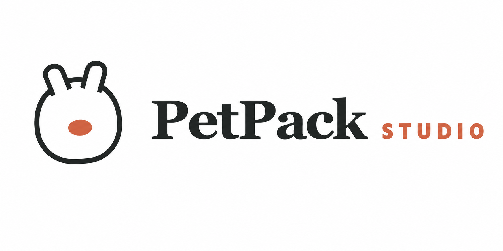

<p align="center">
  
</p>

<p align="center">
  <strong>让你的 Codex 宠物走出 Codex。</strong>
</p>

<p align="center">
  导入 Codex 或 Petdex 宠物包，自动校验动画图集、预览动作，<br>
  并打包成不依赖 Codex 的 Windows、macOS 或 Linux 独立桌宠。
</p>

<p align="center">
  <a href="https://mingfenghong.github.io/petpack/">文档站</a>
  ·
  <a href="https://github.com/MingfengHong/petpack/releases">下载安装包</a>
  ·
  <a href="https://mingfenghong.github.io/petpack/getting-started">快速开始</a>
  ·
  <a href="https://mingfenghong.github.io/petpack/CROSS_PLATFORM">跨平台分发</a>
  ·
  <a href="https://mingfenghong.github.io/petpack/DOCKER">Docker Web 版</a>
</p>

<p align="center">
  <a href="https://github.com/MingfengHong/petpack/releases"></a>
  <a href="https://github.com/MingfengHong/petpack/actions/workflows/build.yml"></a>
  <a href="https://github.com/MingfengHong/petpack/actions/workflows/docs.yml"></a>
  <a href="LICENSE"></a>
  <a href="https://v2.tauri.app/"></a>
</p>

<p align="center">
  
</p>

## v0.3.1 更新

- 重新设计“发布桌宠”区域，明确区分当前平台成品与跨平台构建包。
- 修复高 DPI 下桌宠裁切、固定在角落、不能拖动或缩放的问题。
- 桌宠支持 70%–140% 缩放、底部拖动、悬停工具栏和托盘尺寸菜单。
- Studio 最小化后保留任务栏入口，关闭窗口直接退出进程。
- 新增轻量跨平台构建包、原生 CI 构建矩阵和 Docker Web Studio。

## 为什么需要 PetPack

Codex 自定义宠物依赖 Codex 运行环境，不能直接作为普通桌面应用分发。PetPack Studio 把宠物清单、动画图集和轻量运行时整理成独立应用，让接收者不安装 Codex 也能运行桌宠。

PetPack 不伪装跨操作系统编译能力：当前平台可直接生成原生桌宠；需要跨平台分发时，可使用目标平台构建包或 GitHub Actions 原生 runner。

## 核心能力

| 能力 | 说明 |
| --- | --- |
| 多来源导入 | 支持 Codex v2、Codex/Petdex v1、本地文件夹、ZIP、`pet.json`、spritesheet 和 Petdex 链接。 |
| 严格校验 | 检查清单、图集尺寸、使用帧、透明单元格、路径安全和 v2 版本声明。 |
| 动画预览 | 预览 9 种标准动作；v2 宠物支持 16 个指针注视方向。 |
| 独立桌宠 | 透明无边框、置顶、可拖动、可缩放、托盘运行、不占任务栏。 |
| 当前平台打包 | 生成便携目录、原生运行程序和 ZIP，不依赖 Codex。 |
| 跨平台分发 | 导出宠物资源、轻量 builder 和目标设备构建指引。 |
| Web Studio | 可通过 Docker 部署浏览器上传、校验和构建包下载服务。 |

## 下载安装

打开 [Releases](https://github.com/MingfengHong/petpack/releases)，按系统选择：

| 系统 | 推荐文件 | 适用设备 |
| --- | --- | --- |
| Windows | `PetPack Studio_*_x64-setup.exe` | Windows 10/11 x64 |
| macOS Apple Silicon | `PetPack Studio_*_aarch64.dmg` | M1、M2、M3、M4 等 Apple 芯片 Mac |
| macOS Intel | `PetPack Studio_*_x64.dmg` | Intel Mac |
| Linux | `PetPack Studio_*.AppImage` | 通用便携运行 |
| Debian / Ubuntu | `PetPack Studio_*.deb` | Debian 系发行版 |

当前构建未配置商业代码签名。Windows SmartScreen、macOS Gatekeeper 和 Linux 执行权限处理见[常见问题与排错](https://mingfenghong.github.io/petpack/troubleshooting)。

## 三步生成桌宠

1. **导入**：选择包含 `pet.json` 和 spritesheet 的文件夹或 ZIP，也可以输入 Petdex slug。
2. **检查**：确认格式、图集尺寸、透明帧和动作预览全部通过。
3. **发布**：选择生成当前平台成品，或导出跨平台构建包。

完整操作见[快速开始](https://mingfenghong.github.io/petpack/getting-started)和[使用手册](https://mingfenghong.github.io/petpack/user-guide)。

## 宠物包格式

```text
my-pet/
├── pet.json
└── spritesheet.webp
```

Codex v2 示例：

```json
{
  "id": "my-pet",
  "displayName": "My Pet",
  "description": "A friendly desktop companion.",
  "spriteVersionNumber": 2,
  "spritesheetPath": "spritesheet.webp"
}
```

Codex v2 使用 1536×2288、8×11 图集；Petdex v1 通常使用 1536×1872、8×9 图集。完整帧占用和安全规则见[宠物包格式](https://mingfenghong.github.io/petpack/PET_FORMATS)。

## 跨平台分发

Studio 提供两种发布方式：

- **当前平台成品**：生成当前系统可以直接运行的便携桌宠和 ZIP。
- **跨平台构建包**：在目标 Windows、macOS 或 Linux 设备运行轻量 builder，生成对应平台原生桌宠。

没有目标平台设备时，可以使用 `.github/workflows/build-pet.yml` 在 GitHub 原生 runner 上构建。详见[跨平台构建与分发](https://mingfenghong.github.io/petpack/CROSS_PLATFORM)。

## Docker Web Studio

```bash
docker compose up --build -d
```

打开 `http://localhost:8080`，上传宠物 ZIP，即可完成格式校验并下载跨平台构建包。Docker 部署边界和 builder 挂载方式见[Docker Web 版](https://mingfenghong.github.io/petpack/DOCKER)。

## 从源码开发

需要 Node.js 20+、Rust stable 和当前系统的 Tauri 2 依赖：

```bash
git clone https://github.com/MingfengHong/petpack.git
cd petpack
npm ci
npm test
npm run tauri dev
```

构建当前平台：

```bash
npm run tauri build
```

文档站本地预览：

```bash
npm run docs:dev
```

开发依赖、CI 产物和发布流程见[开发和发布构建](https://mingfenghong.github.io/petpack/development)。

## 安全边界

- ZIP 只读取一个宠物根目录中的 `pet.json` 和它引用的 PNG/WebP 图集。
- 拒绝绝对路径、盘符路径、`..` 路径穿越和多宠物歧义 ZIP。
- `pet.json` 最大 256 KiB，spritesheet 最大 16 MiB。
- Petdex 在线导入只接受 `https://assets.petdex.dev` 资源。
- 本地导入和桌宠运行时不访问 `~/.codex`，也不执行宠物包中的脚本。

详细验证证据见[测试报告](https://mingfenghong.github.io/petpack/TEST_REPORT)。

## 参考与许可证

窗口形态参考 [ayangweb/BongoCat](https://github.com/ayangweb/BongoCat)，Petdex 识别参考 [crafter-station/petdex](https://github.com/crafter-station/petdex)。PetPack Studio 没有捆绑二者的宠物素材。

项目采用 [MIT License](LICENSE)。用户导入的宠物素材仍受其原作者许可和权利约束。
